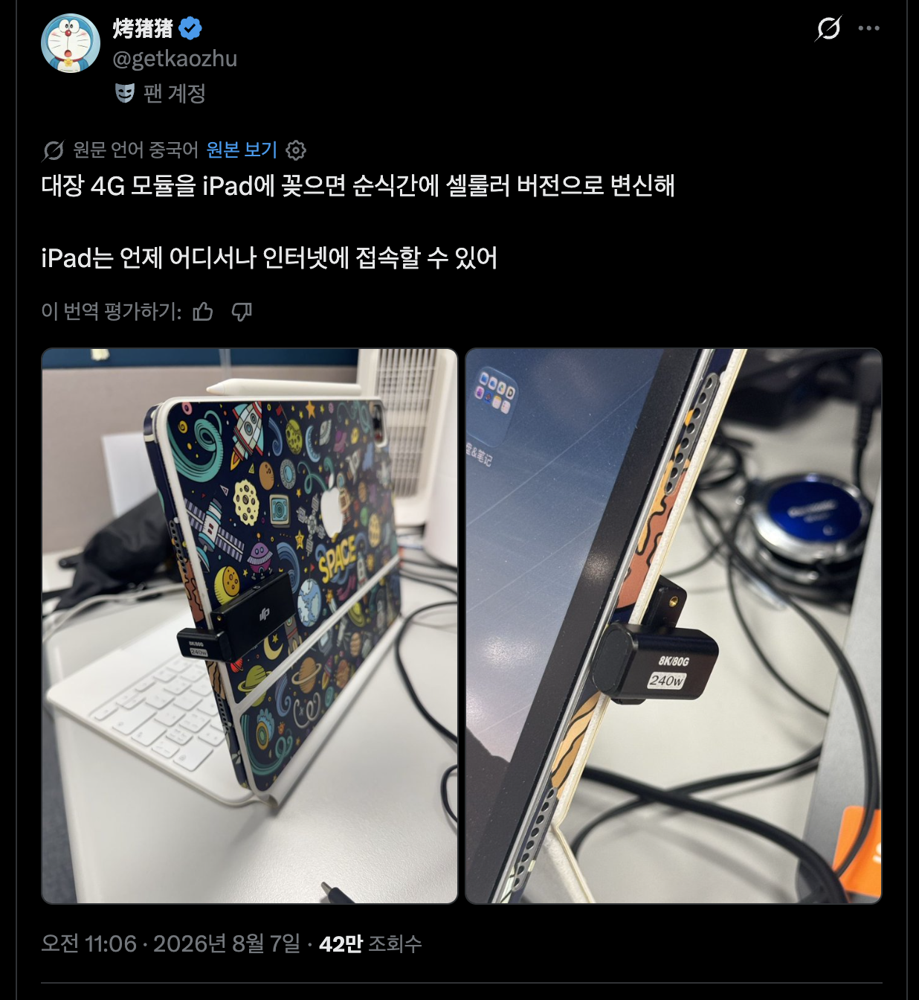
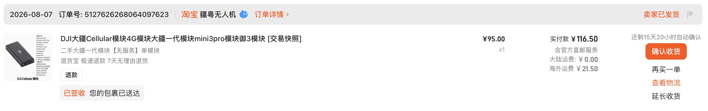
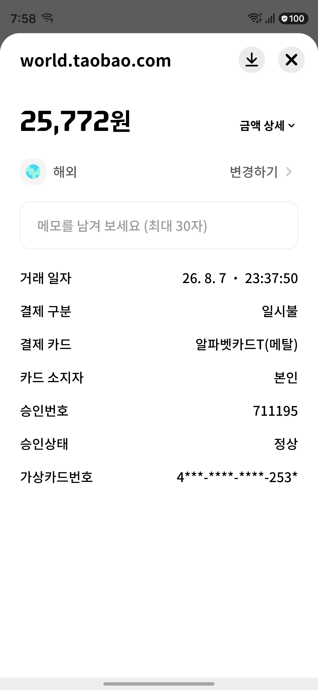
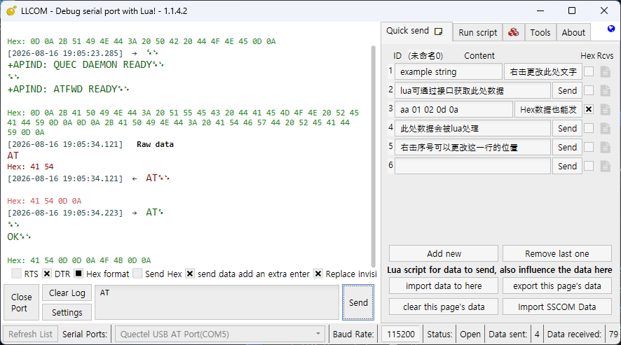
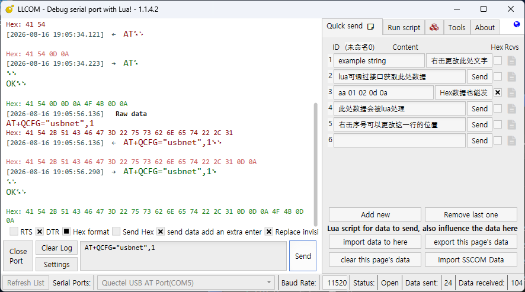
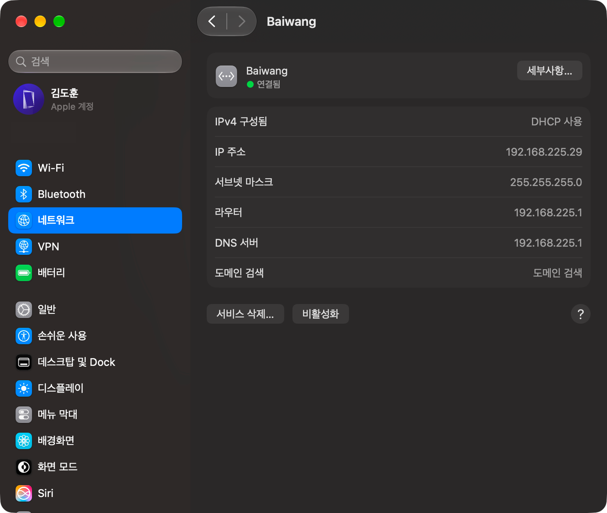
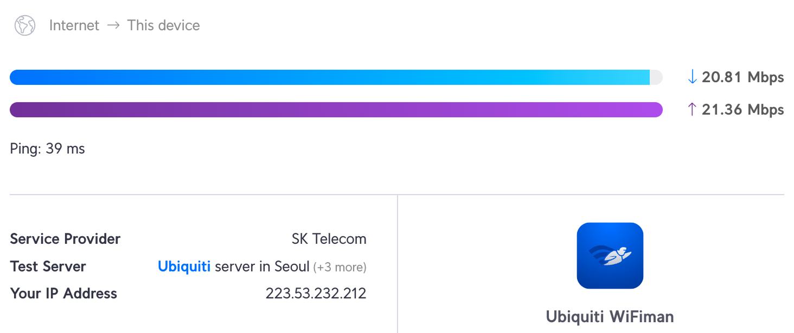
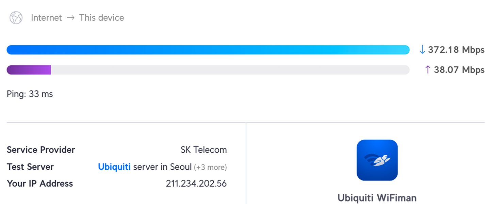

import teaser from "./Teaser.jpg";

export const meta = {
  teaser,
  category: "후기",
  title: "MacBook 셀룰러를 만들 수 있을 줄 알았는데",
  date: "2026-08-20T22:53:00+09:00",
};

어느 날 [iPad에 DJI 4G 동글 1세대를 연결하면 셀룰러를 사용할 수 있다는 글](https://x.com/getkaozhu/status/2085548078690689199)을 접하게 되었습니다.

이게 무슨 이야기인지 더 알아보니, DJI 4G 동글 1세대에 약간의 설정을 해주면 4G 모뎀처럼 사용할 수 있다는 것이었습니다.

# 바로 구매

---

주 사용 노트북인 MacBook Pro에 항상 핫스팟을 켜서 연결하는 것에 큰 귀찮음을 느끼고 있었기 때문에 이를 해소해줄 것이라고 생각하고 타오바오에서 바로 구매했습니다.

배송비 포함 116.5위안이라고 나와 있는데, 제 카드로 25,772원이 청구되었습니다.

배송은 10일 정도 걸렸고, 동글에는 사용감이 좀 있는 편이었습니다. 그게 중요한 게 아니니 바로 4G 모뎀으로 사용하기 위해 설정을 해보도록 하겠습니다.

# iPadOS, macOS에서 4G 모뎀으로 동작하게 하기

---

DJI 4G 동글 1세대를 iPadOS나 macOS에서 사용하실 것이 아니라면, 다음에 서술할 단계를 따르지 않고도 Quectel NDIS 드라이버 설치만으로 4G 모뎀으로 동작합니다.

DJI 4G 동글 1세대는 Quectel사의 EG25G-QDC507 모뎀을 기반으로 하는 기기입니다. iPadOS나 macOS에서 사용하려면 이를 ECM 모드로 변경해야 합니다.

이를 수행하기 위해서는 Windows가 설치된 PC, 데이터 통신이 가능한 USB-C 케이블, [Quectel NDIS 드라이버(로그인 필요)](https://www.quectel.com/download/quectel_windows_usb_driverq_ndis_v2-8_en), 시리얼 터미널 프로그램이 필요합니다.

먼저, Windows가 설치된 PC에 Quectel NDIS 드라이버를 설치하고 PC와 DJI 4G 동글 1세대를 데이터 통신이 가능한 USB-C 케이블로 연결합니다.

그 후, 시리얼 터미널 프로그램을 열어 Quectel USB AT Port (COM5)를 선택합니다. 이때 COM5의 숫자 5는 PC에 따라 다르게 나올 수 있습니다.

제대로 연결되었는지 확인하기 위해 `AT` 명령을 입력하고 OK라고 응답이 반환되는지 확인합니다. 응답이 반환된다면 올바르게 연결된 것입니다.

올바르게 연결되었다면 `AT+QCFG="usbnet",1` 명령을 입력하고 OK라고 응답이 반환되면 iPadOS와 macOS에서 사용할 준비가 끝났습니다.

# macOS에서 사용하기

---

앞서 서술한 절차를 따르고 Mac에 연결하면 네트워크 설정 항목에 'Baiwang'이라는 네트워크 인터페이스가 생성됩니다.

연결 후 어느 정도 속도가 나오는지 궁금하여서 [WiFiman.com](https://wifiman.com)에서 속도 측정을 해보았습니다.

제 생각보다 너무 낮은 결과가 나왔습니다. 혹시나 해서 비교를 위해 iPhone 17에 SKT 5G 요금제를 사용하는 상태로 실내에서 인스턴스 핫스팟에 연결하여 속도 측정을 해보았습니다.

iPhone 17의 핫스팟 속도가 압도적으로 빨랐습니다. 다운로드 속도는 약 17.9배, 업로드 속도는 약 1.8배 빠릅니다.

그래서 사용을 못 할 정도의 속도라고 하면 그건 아닙니다. 비트레이트가 128kbps로 설정된 디스코드 음성 채널에서 통화를 하며 720p 60fps로 진행되는 라이브를 시청해도 문제없는 정도였고, 1080p 유튜브 영상을 끊김 없이 보는 데에는 충분했습니다.

다만, 대용량의 파일을 다운로드하거나, 4K 영상 스트리밍에는 약간의 답답함이 느껴졌습니다.

# 기대에는 미치지 못했지만

---

중국에서는 [DJI 4G 동글 1세대를 이용하여 Mac에서 통화, 문자 수발신이 가능하게 하는 프로젝트](https://github.com/celldock/celldock-for-mac) 같은 오픈 소스 프로젝트나 연구가 진행되어 4G 통신망을 이용하여 인터넷 연결 하는 것을 넘어 더 활용할 수는 있지만, 저는 딱히 필요성을 느끼지는 못했습니다.

사실 DJI 4G 동글 1세대가 기반으로 하는 Quectel사의 EG25G-QDC507 모뎀은 LTE Cat. 4까지만 지원하여 이론상 최고 다운로드 속도는 150Mbps, 최고 업로드 속도는 50Mbps입니다.

저는 실내에서 테스트했기 때문에 이론상 최고 속도에 미치지 못했지만, DJI 4G 동글 1세대를 용도대로 실외에서 사용하거나 추가 안테나까지 장착한다면, 이론상 최고 속도로 사용할 수 있지 않을까 싶습니다.

결국 처음 기대했던 것처럼 MacBook에 동글만 연결하면 바로 인터넷을 사용할 수 있게 되기는 했습니다. 매번 iPhone의 핫스팟을 켜지 않아도 되고, macOS에서 별도의 드라이버를 설치하지 않아도 네트워크 인터페이스로 인식된다는 점은 꽤 편리했습니다.

하지만 실제로 사용해 보니 속도와 휴대성 모두 iPhone의 인스턴트 핫스팟을 사용하는 편이 더 나았습니다. 동글을 따로 챙겨야 하고 데이터용 유심도 필요하므로, 제가 원했던 '셀룰러가 내장된 MacBook'과는 거리가 있었습니다.

그래도 25,772원으로 AT 명령을 이용해 모뎀의 USB 네트워크 모드를 바꿔보고, macOS에서 별도의 드라이버 없이 4G 통신망으로 인터넷 연결이 가능한 것을 확인했으니 재미있는 경험이었습니다.

사용하지 않는 데이터 유심이 있거나 핫스팟을 사용하기 어려운 환경이라면 충분히 활용할 만하지만, 저처럼 단순히 핫스팟을 켜는 과정이 귀찮아서 구매하려는 경우에는 그냥 iPhone의 인스턴트 핫스팟을 사용하는 것이 나을 것 같습니다.

그렇게 MacBook 셀룰러를 만들어보려던 시도는 성공은 했지만, 결국 다시 핫스팟으로 돌아가는 것으로 끝났습니다.