import teaser from "./Teaser.jpg";

export const meta = {
  teaser,
  category: "후기",
  title: "보안에 그렇게 좋다는 YubiKey 사용해보기",
  date: "2026-09-09T22:30:00+09:00",
};

예전부터 YubiKey 같은 FIDO 보안 키에 관심이 있었습니다. 비밀번호 관리자를 직접 호스팅할 만큼 보안에 관심이 많았기 때문입니다. 하지만 딱히 살 명분이 없어서 구매하지 않고 있었는데, OpenAI에서 아래와 같은 메일을 받게 됩니다.

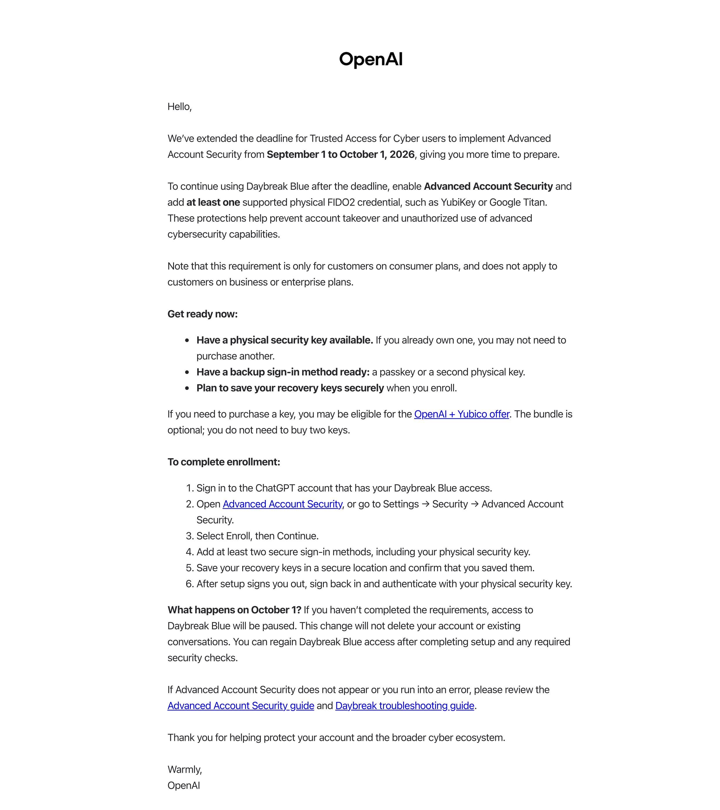

OpenAI가 보낸 메일의 내용은 2026년 10월 1일부터 Daybreak Blue 사용을 계속하려면 고급 계정 보안을 활성화하고 YubiKey 같은 물리적 FIDO2 보안 키를 등록해야 한다는 것입니다. 명분도 생겼으니, 아마존에서 2개, OpenAI 전용 할인으로 2개 구매했습니다.

# YubiKey 구매하기

---

[아마존](https://www.amazon.com/)에서는 YubiKey 5C NFC와 YubiKey 5 NFC를 각각 $58에 구매했고, 배송은 딱 일주일 만에 받았습니다. 아마존에서는 분명 'Shipped with HANJIN'이라고 적혀 있었는데, 통관만 한진에서 하고 국내 발송은 '두발히어로'라는 곳에서 담당했습니다.

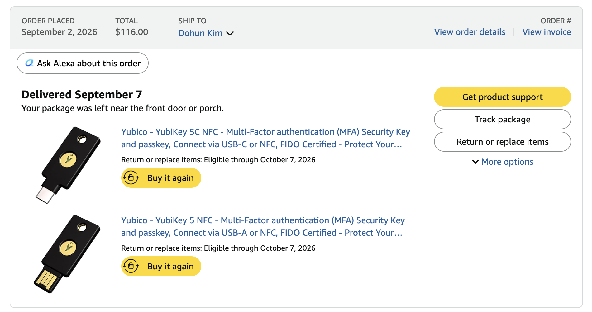

[OpenAI 번들 할인](https://chatgpt.com/yubikey)으로는 YubiKey C NFC와 YubiKey C Nano를 같이 $68에 인당 3개까지만 판매하고 있어서 이것도 구매했습니다. 언제나 받아도 기분 좋은 국제 민간 탁송사인 DHL, FedEx, UPS 중 FedEx로 배송받았습니다.

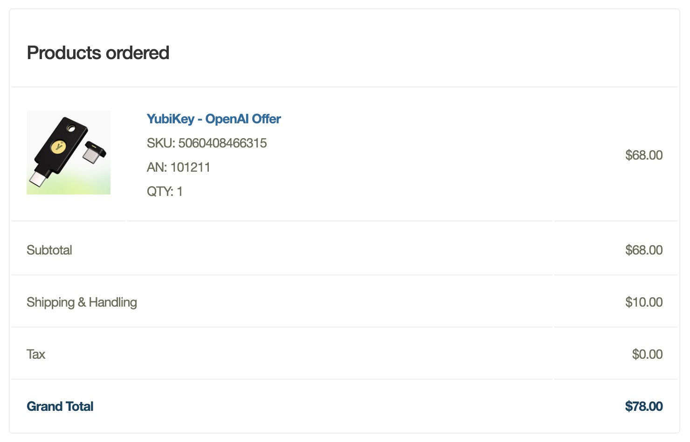

OpenAI 번들 할인 제품의 경우 TOTP 기능이 빠진 제품이고 시리즈 명도 붙어 있지 않은 게 좀 이상하긴 했지만, 거의 1개 가격에 2개를 구매할 수 있다는 점이 매력적이며, 패키징에 무려 OpenAI 로고가 함께 있습니다.

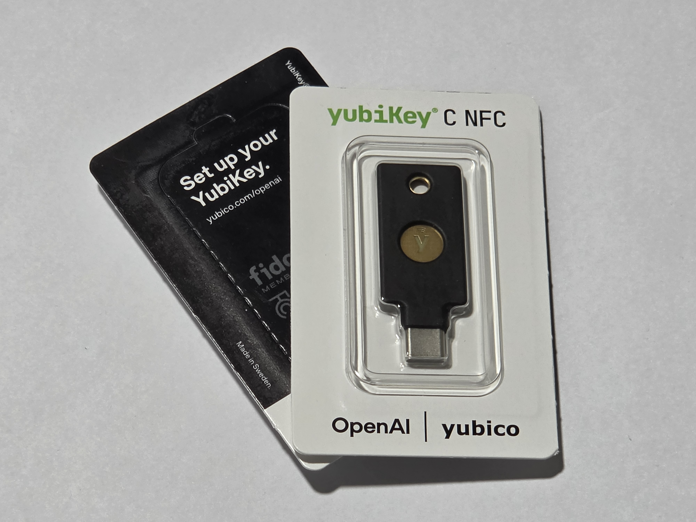

# YubiKey Authenticator를 통한 설정

---

YubiKey에 TOTP를 저장/열람하거나 저장된 패스키를 확인하는 등 관리를 하기 위해서는 [Yubico Authenticator](https://www.yubico.com/products/yubico-authenticator/#h-download-yubico-authenticator)를 사용해야 합니다.

Linux, macOS, Windows, Android, iOS 모두 지원하니 거의 모든 기기에서 [Yubico Authenticator](https://www.yubico.com/products/yubico-authenticator/#h-download-yubico-authenticator) 사용이 가능하다고 보아도 무방해 보입니다.

NFC가 지원되는 Android, iOS 기기를 사용할 경우, 한 번도 USB 연결을 하지 않고 NFC 인식을 하면 iOS에서는 [이 페이지](https://www.yubico.com/getting-started/)로 안내하고 안드로이드에서는 아래와 같이 표시되며 최초 USB 연결을 요구합니다.

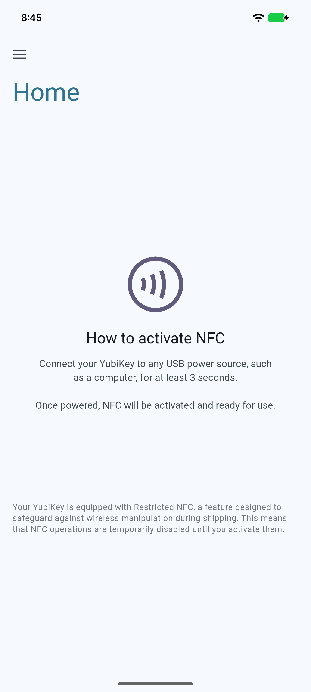

안내대로 USB 연결을 하여 전원 인가를 해보면, YubiKey 로고 부분에서 초록색 불빛이 점등되며 켜지는데, 생각보다 비싼 물건을 구매했는데 로고에 균일하게 점등되지 않는 부분은 조금 불만입니다.

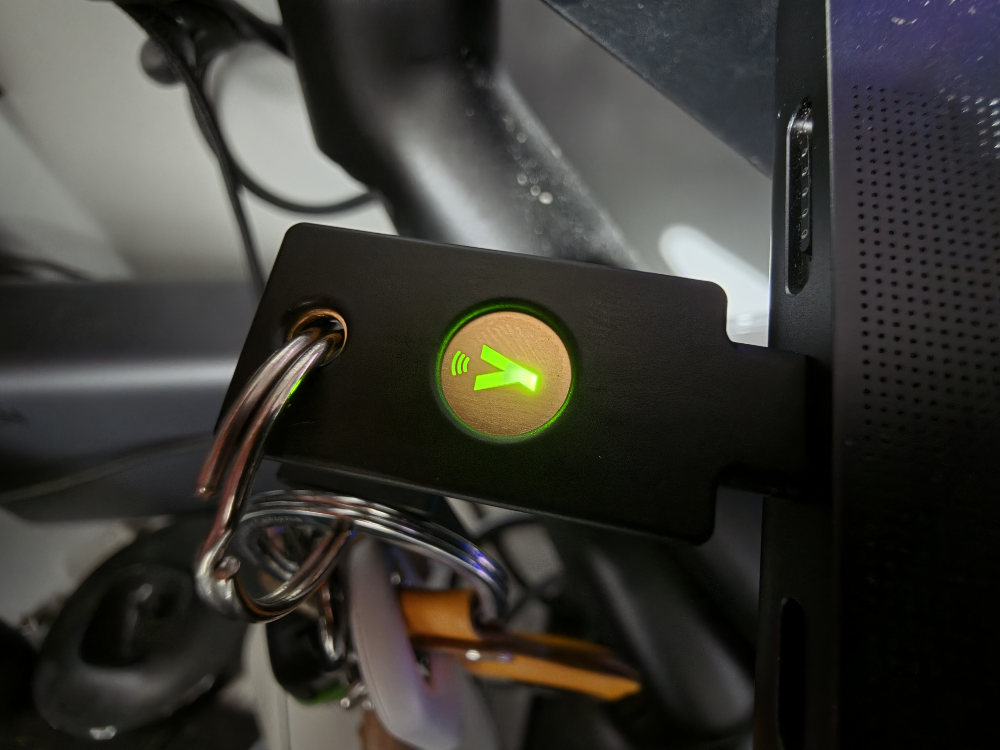

이렇게 USB 연결을 하면 [Yubico Authenticator](https://www.yubico.com/products/yubico-authenticator/#h-download-yubico-authenticator)에서 본격적인 사용이 가능해집니다. YubiKey 5C NFC, YubiKey 5 NFC 기준, 처음 마주하는 홈 탭은 아래와 같습니다.

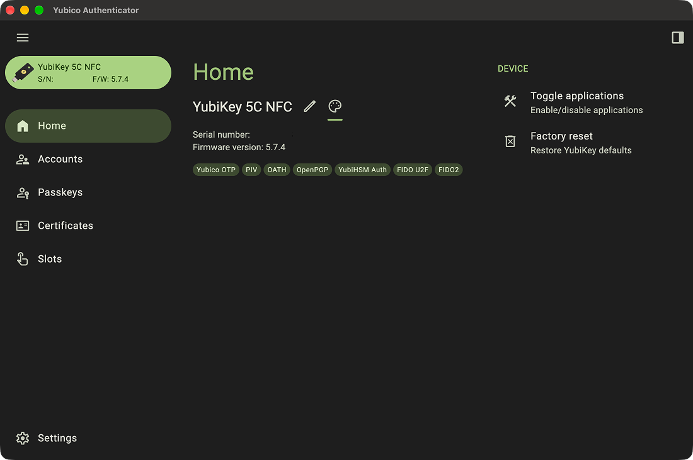

홈과 사이드바에는 YubiKey의 이름, 고유 번호, 펌웨어 버전이 표시됩니다. 홈에서는 YubiKey의 이름을 변경하거나, [Yubico Authenticator](https://www.yubico.com/products/yubico-authenticator/#h-download-yubico-authenticator)의 전반적인 색상을 변경할 수 있었고 YubiKey의 기능을 활성/비활성화하거나 YubiKey를 공장 초기화 할 수 있었습니다.

TOTP 또는 HOTP를 추가할 수 있는 Account 탭은 아래와 같습니다.

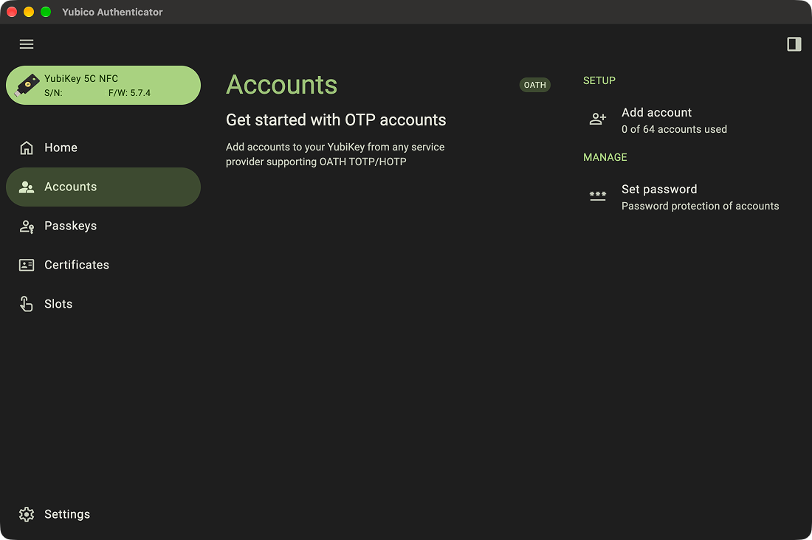

인상 깊었던 부분은 SHA-1, SHA-256, SHA-512 세 가지 해시 알고리즘을 모두 지원한다는 점이었는데, 대부분의 서비스가 SHA-1 기반 TOTP만 요구하는 걸 고려하면 다소 과한 스펙처럼 느껴지기도 했습니다. 자릿수도 6자리와 8자리를 선택할 수 있었고, 기본 30초 주기(period) 외에 커스텀 주기 설정도 가능했습니다.

한 가지 특이한 점은 계정을 추가할 때 `Require touch` 옵션이 있다는 것이었습니다. 이 옵션을 켜면 코드를 조회할 때마다 YubiKey 본체를 직접 터치해야만 값이 표시되는데, 단순히 키를 컴퓨터에 꽂아두기만 해도 소프트웨어적으로 코드를 긁어갈 수 있는 공격을 막기 위한 물리적 안전장치였습니다.

하지만 저는 사용하지 않을 예정입니다. 아이디와 비밀번호 모두 저장되는 것이 아닌, OTP만 저장하고 사이트마다 자동 완성도 지원하지 않으며 제가 사용하는 TOTP는 56개인데 64개 저장 제한이 있기 때문입니다.

저장된 패스키들을 확인할 수 있는 Passkey 탭은 아래와 같습니다.

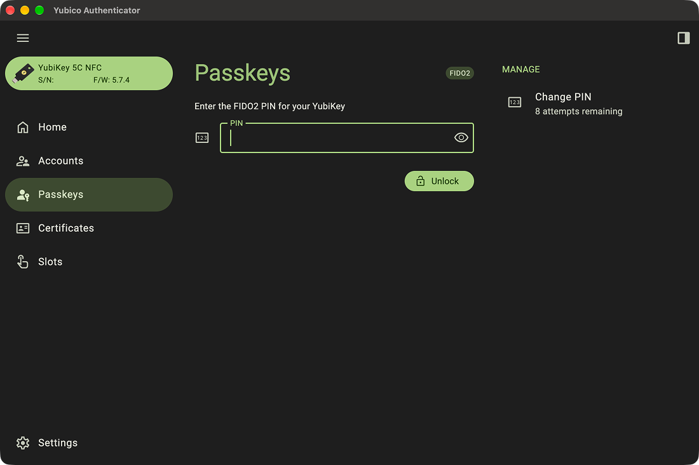

저는 설정을 완료한 상태라 비밀번호를 입력하라고 표시되지만 설정하지 않으신 분들은 저장된 패스키가 없는 목록이 나오고 비밀번호 설정이 가능하실 겁니다. 저는 Apple 계정, Microsoft 계정, GitHub 계정 등에 설정해 두었는데 이 목록에 표시되는 패스키가 있고 표시되지 않는 패스키도 있더군요.

가장 생소했던 Certificates 탭은 아래와 같습니다.

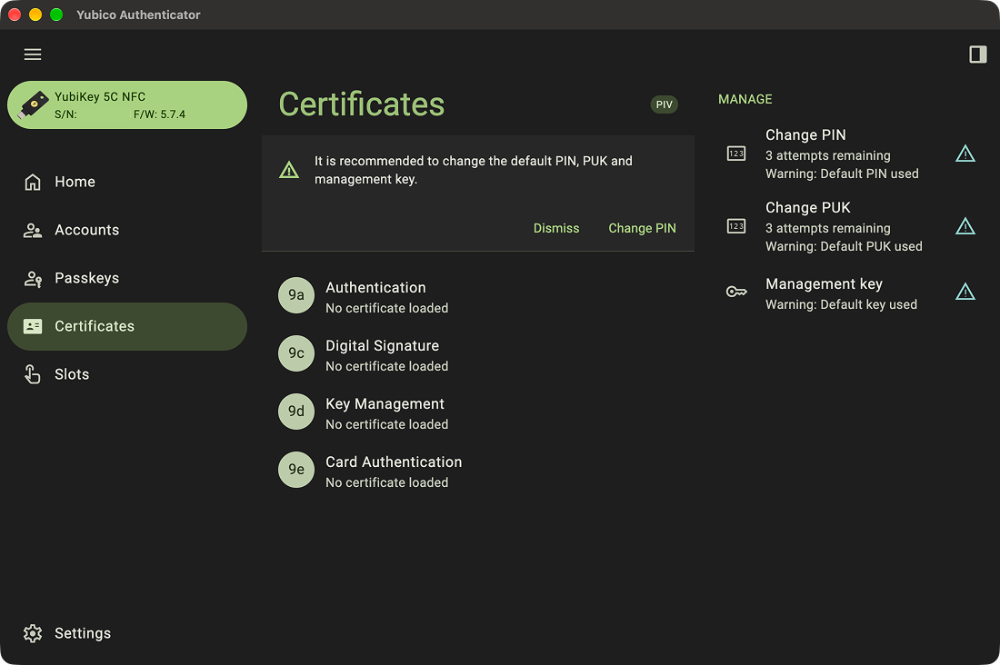

Certificates 탭은 YubiKey에 내장된 PIV(Personal Identity Verification) 애플릿을 다루는 화면으로, 사실상 YubiKey를 하나의 스마트카드처럼 취급해 X.509 인증서와 개인 키 쌍을 슬롯 단위로 저장하는 기능이었습니다.

사실 이 탭은 무슨 기능을 하는지 몰라 생성형 AI에게 물어보았습니다. PIV는 총 4개의 표준 슬롯(9A: 인증, 9C: 디지털 서명, 9D: 키 관리/암호화, 9E: 카드 인증)으로 구성되어 있고, 슬롯마다 인증서를 가져오거나(Import), 키를 직접 생성해서 인증서 서명 요청(CSR)을 만들 수도 있다고 하는군요.

실제로 여기 있는 기능은 개인이 일상적으로 쓰기보다는 기업 환경에서 스마트카드 로그인(Windows 도메인 로그인, macOS 로그인, SSH 클라이언트 인증서 등)을 구현할 때 쓰는 용도에 가깝다고 합니다.

YubiKey에 있는 로고를 누를 때 액션을 지정하는 Slots 탭은 아래와 같습니다.

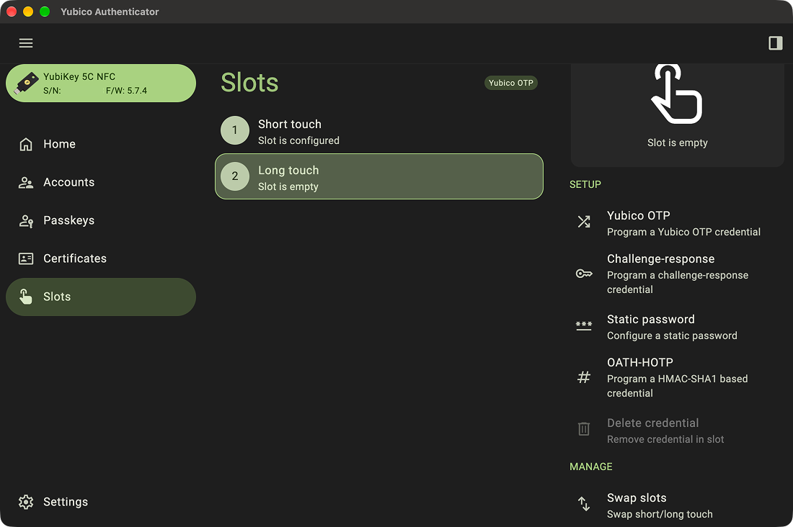

YubiKey 하나에 물리적으로 동작을 지정이 가능한 슬롯은 딱 두 개뿐입니다. 이 탭에서 짧게 터치하느냐 길게 눌러 터치하느냐에 대한 액션을 지정할 수 있습니다.

슬롯 하나를 선택하면 오른쪽 화면에 선택한 슬롯에 대한 동작이 지정되어 있는지 나오고, 아래 'SETUP' 섹션에서슬롯에 대한 동작을 지정할 수 있습니다.

Yubico OTP는 Yubico 자체 규격의 OTP 자격 증명을 굽는 옵션, Challenge-response는 HMAC 기반 챌린지-리스폰스 자격 증명을 굽는 옵션, Static password는 고정 비밀번호를 설정하는 옵션, OATH-HOTP는 HMAC-SHA1 기반 HOTP 자격 증명을 슬롯에 굽는 옵션입니다.

흥미로웠던 점은 HOTP가 Accounts 탭(OATH 애플릿)뿐 아니라 이 슬롯 기반으로도 동작 지정이 가능하다는 것이었는데, 슬롯에 구운 HOTP는 인증 앱을 거치지 않고 터치 한 번으로 즉시 코드 문자열이 키보드 입력처럼 그대로 타이핑되는 방식이라, Accounts 탭의 OATH-HOTP와는 사용 경험 자체가 다릅니다.

# 보안 키로 사용하기

---

GitHub, Apple, Microsoft 등 이런 FIDO2 보안 키를 지원하는 서비스와 FIDO2 보안 키를 등록하는 것은 매우 간단합니다. 대부분의 서비스가 계정 보안 설정 안에 "보안 키(Security Key)" 추가 메뉴를 두고 있고, 이 메뉴를 누르면 브라우저가 WebAuthn API를 호출해 운영체제 차원의 등록 창을 띄워주는 방식이었습니다.

Facebook에서 보안 키를 등록해 보겠습니다. Facebook은 [계정 센터](https://accountscenter.facebook.com/)에서 등록할 수 있습니다.

Facebook의 [계정 센터](https://accountscenter.facebook.com/)에서 2단계 인증 메뉴를 선택하고, '백업 수단 추가'의 '보안 키'를 선택하면 등록할 수 있습니다. 크롬 기준, 등록하기를 눌러 진행하면 아래와 같이 패스키 저장 위치를 선택하라고 표시됩니다.

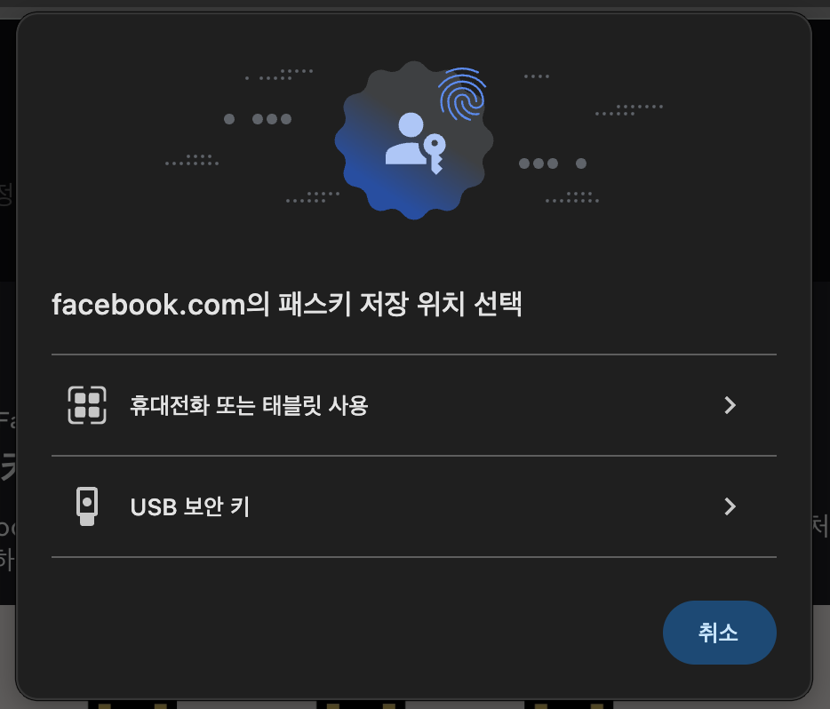

여기서 USB 보안 키를 누르고, 지침을 따릅니다.

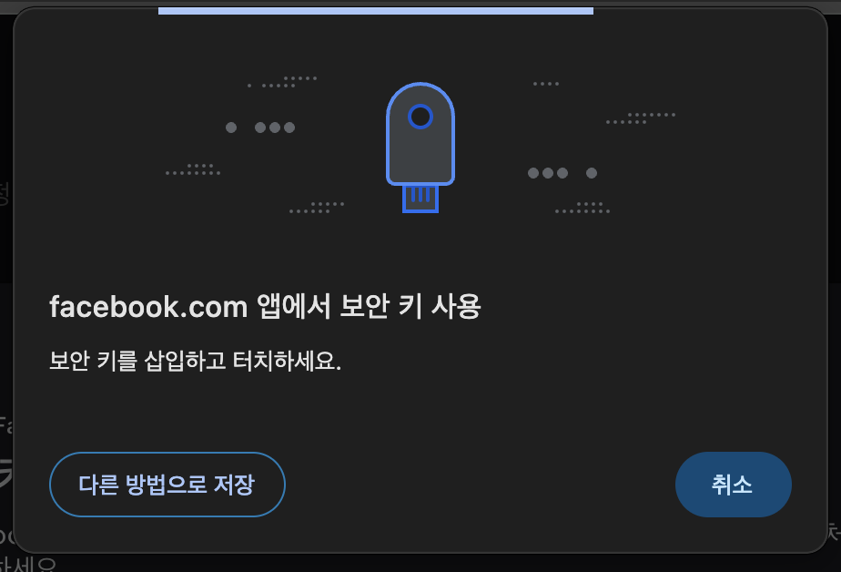

그러면 YubiKey의 비밀번호를 지정하신 분은 아래처럼 비밀번호를 입력하라는 문구가 나오고, 설정하지 않은 분들은 이때 비밀번호를 설정하게 됩니다.

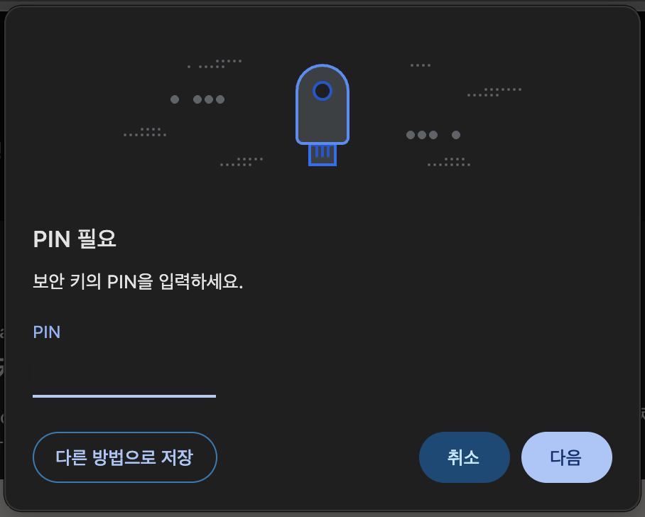

이 과정을 완료하면 보안 키를 다시 터치해 달라는 지시가 나오고, 이를 마치면 등록이 완료됩니다.

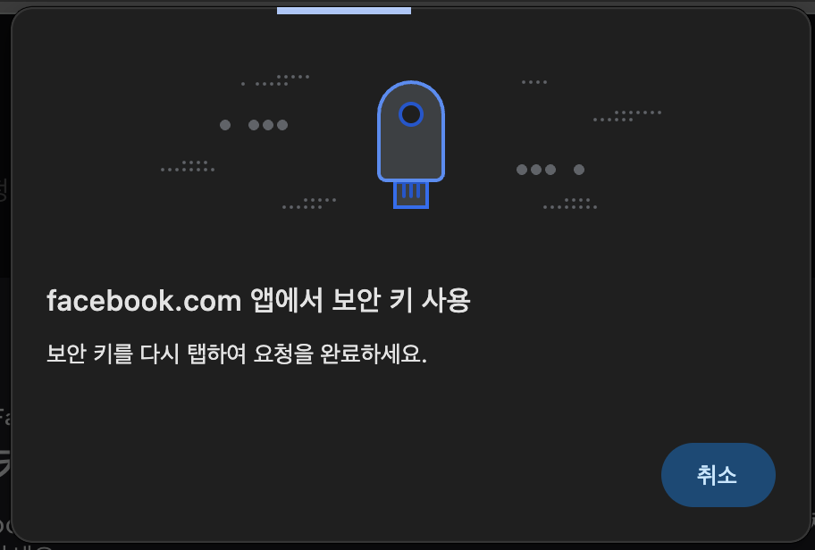

# 마치며

---

제가 사용하는 서비스 중, FIDO2 보안 키를 지원하는 서비스들에는 모두 2개의 YubiKey를 등록해 두었습니다. Apple 계정 같은 경우에는 아예 보안 키를 2개 이상 등록하는 것이 필수이며, 2개 이상의 보안 키 등록을 강제하지 않는 사이트여도 보조 보안 키를 등록해 두는 것이 좋습니다.

YubiKey 하나가 고장 나거나 분실되어도 나머지 하나로 로그인이 가능하게, 그리고 만약 두 개 다 분실했을 때를 대비해 각 서비스에서 제공하는 복구 코드(recovery code)도 별도로 오프라인 백업을 해두었습니다. 아무리 보안 키가 안전하다고 해도, 결국 물리적인 하드웨어이기 때문에 분실이나 파손 가능성 자체를 없앨 수는 없다는 걸 이번에 설정하면서 다시 한번 체감했습니다.

정작 이 모든 걸 시작하게 만든 계기였던 OpenAI 계정에도 물론 등록을 마쳤습니다. 계정 설정의 Advanced Account Security 메뉴에서 진행했는데, 앞서 소개한 Facebook과 흐름 자체는 크게 다르지 않았습니다.

총정리하자면, 아마존에서 2개(각 $58, 합 $116)와 OpenAI 번들 할인으로 2개($68에 세트 구매)를 더해 총 4개의 YubiKey에 대략 20만 원 남짓을 썼습니다. 하나만 있어도 충분했을 수도 있지만, 서비스마다 최소 2개를 요구하거나 백업 없이 등록했다가 키를 잃어버렸을 때의 위험을 생각하면 이 정도 지출은 아깝지 않다는 생각이 듭니다. 애초에 비밀번호 관리자를 자체 호스팅할 정도로 보안에 신경 쓰던 입장에서, 그동안 FIDO2 보안 키만 빠져 있었다는 게 오히려 이상했던 셈이니까요.

만약, YubiKey 가격이 부담되신다면 다른 저렴한 FIDO2 보안 키도 있으니 한번 확인해 보시는 것도 좋을 것 같습니다. 아니면 [Raspberry Pi Pico나 ESP32를 FIDO2 보안 키로 만드는 펌웨어](https://github.com/polhenarejos/pico-fido)를 사용해서 만드시는 것도 재밌는 일이 될 것 같습니다.

혹시 저처럼 딱히 살 명분이 없어서 미루고 계셨다면, 이번 기회에 하나쯤 장만해 보시는 것도 나쁘지 않을 것 같습니다.